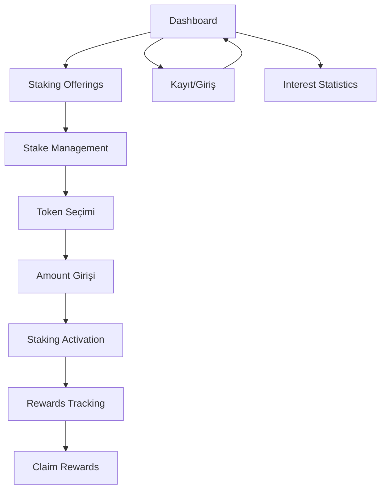

# StakeHub MVP - Ürün Gereksinim Dokümanı

## 1. Ürün Genel Bakış

StakeHub, kullanıcıların staking protokollerini kolayca takip edebileceği, stake işlemlerini yönetebileceği ve rewards'larını izleyebileceği modern bir web platformudur. 2 kişilik ekip ile 2 hafta (56 saat) sürede geliştirilecek minimum viable product (MVP) olarak tasarlanmıştır.

Temel amaç: Kullanıcılara staking fırsatlarını tek bir dashboard'da sunmak, gerçek zamanlı APY verilerini göstermek ve basit stake yönetimi sağlamak.
Hedef pazar: DeFi yatırımcıları ve staking ile pasif gelir elde etmek isteyen kullanıcılar.

## 2. Temel Özellikler

### 2.1 Kullanıcı Rolleri

| Rol               | Kayıt Yöntemi     | Temel Yetkiler                       |
| ----------------- | ----------------- | ------------------------------------ |
| Ziyaretçi         | Kayıt gerektirmez | Protokolleri görüntüleme, filtreleme |
| Kayıtlı Kullanıcı | Email ile kayıt   | Yorum yapma, favorilere ekleme       |

### 2.2 Özellik Modülü

MVP kapsamında aşağıdaki temel sayfalar geliştirilecektir:

1. **Dashboard (Ana Sayfa)**: Staking offerings, protokol listesi, gerçek zamanlı veriler
2. **Stake Management**: Token seçimi, stake amount girişi, staking activation
3. **Rewards Tracking**: Kullanıcı rewards'ları, claim işlemleri, istatistikler
4. **Protokol Detay Sayfası**: Protokol bilgileri, APY grafikleri, performans metrikleri
5. **Kayıt/Giriş Sayfası**: Basit email/şifre ile kayıt ve giriş

### 2.3 Sayfa Detayları

**🎯 MVP Öncelik Sırası (2 Hafta):**

* **Hafta 1**: Dashboard + Staking Offerings + Temel UI

* **Hafta 2**: Stake Management + Rewards Tracking + Polish

| Sayfa Adı        | Modül Adı           | Özellik Açıklaması                                                                                   | MVP Öncelik |
| ---------------- | ------------------- | ---------------------------------------------------------------------------------------------------- | ----------- |
| Dashboard        | Sol Navigasyon      | Home, Pair Explore, Live New Pairs, Token, Wallet Info menüleri                                      | ⭐ Yüksek    |
| Dashboard        | Staking Offerings   | Protokol kartları (Cardano, Ontology, Salona, Polkadot, XRP), APY oranları, minimum stake miktarları | ⭐ Yüksek    |
| Dashboard        | Stake Now Butonları | Her protokol için hızlı stake başlatma                                                               | ⭐ Yüksek    |
| Stake Management | Token Seçimi        | Dropdown ile stake edilecek token seçimi                                                             | ⭐ Yüksek    |
| Stake Management | Amount Girişi       | Stake miktarı girişi ve validasyon                                                                   | ⭐ Yüksek    |
| Stake Management | Staking Activation  | Lock-up süreleri, stake tarihleri, onay formu                                                        | 🔶 Orta     |
| Rewards Tracking | Rewards Listesi     | Geçmiş rewards, claim butonları, zaman bilgisi                                                       | 🔶 Orta     |
| Rewards Tracking | Interest Statistics | Aylık performans grafikleri, kazanç analizi                                                          | 🔻 Düşük    |
| Protokol Detay   | Fiyat Grafikleri    | Gerçek zamanlı token fiyat grafikleri                                                                | 🔻 Düşük    |
| Kayıt/Giriş      | Kullanıcı Kaydı     | Email, şifre ile kayıt                                                                               | ⭐ Yüksek    |
| Kayıt/Giriş      | Kullanıcı Girişi    | Email, şifre ile giriş                                                                               | ⭐ Yüksek    |

## 3. Temel Süreç

**Ziyaretçi Akışı:**

1. Dashboard'a giriş → Staking offerings görüntüleme
2. Protokol seçimi → APY ve minimum stake bilgilerini inceleme
3. Kayıt olma → Stake işlemi başlatma

**Kayıtlı Kullanıcı Akışı:**

1. Giriş yapma → Dashboard
2. Token ve miktar seçimi → Staking activation
3. Rewards tracking → Kazançları izleme ve claim etme
4. Interest statistics → Performans analizi

## 4. Kullanıcı Arayüzü Tasarımı

### 4.1 Tasarım Stili

* **Tema**: Modern Dark Theme (siyah/koyu gri arkaplan)

* **Ana Renkler**: Mavi (#4F46E5), Turuncu (#F59E0B), Beyaz (#FFFFFF)

* **Arkaplan**: Koyu gri (#1F2937), Siyah (#111827)

* **Kartlar**: Koyu gri (#374151) arkaplan, subtle border

* **Buton Stili**: Rounded corners, gradient effects, hover animations

* **Font**: Inter, 12px-20px arası boyutlar, medium/semibold weights

* **Layout**: Sol navigasyon + ana content area, card-based design

* **İkonlar**: Cryptocurrency icons, Heroicons, minimal style

* **Animasyonlar**: Smooth transitions, hover effects, loading states

### 4.2 Sayfa Tasarım Genel Bakışı

| Sayfa Adı        | Modül Adı         | UI Elementleri                                                     |
| ---------------- | ----------------- | ------------------------------------------------------------------ |
| Dashboard        | Sol Navigasyon    | Vertical menu, icons + text, active state highlighting             |
| Dashboard        | Staking Offerings | Protocol cards grid, crypto icons, APY badges, "Stake Now" buttons |
| Dashboard        | Header            | Search bar, user profile, notifications                            |
| Stake Management | Token Selector    | Dropdown with crypto icons, balance display                        |
| Stake Management | Amount Input      | Number input, max button, USD equivalent                           |
| Stake Management | Activation Form   | Date pickers, lock period selector, confirmation modal             |
| Rewards Tracking | Rewards Cards     | Earning amounts, claim buttons, time stamps                        |
| Rewards Tracking | Statistics        | Line charts, percentage changes, color-coded gains                 |
| Protokol Detay   | Price Charts      | Candlestick/line charts, time period selectors, real-time updates  |

### 4.3 Responsive Tasarım

**Desktop-first yaklaşım** (ana hedef desktop kullanıcıları):

* **Desktop (1200px+)**: Sol navigasyon + geniş content area, 3-4 column grid

* **Tablet (768px-1199px)**: Collapsible sidebar, 2 column grid

* **Mobile (320px-767px)**: Bottom navigation, single column, touch-optimized buttons

* **Touch Interactions**: Swipe gestures, tap feedback, mobile-friendly form inputs

### 4.4 Özel UI Bileşenleri

* **Protocol Cards**: Crypto logo + name + APY badge + stake button

* **APY Indicators**: Color-coded percentages (yeşil: >10%, turuncu: 5-10%, kırmızı: <5%)

* **Stake Buttons**: Gradient background, hover animations

* **Charts**: Dark theme compatible, responsive, interactive tooltips

* **Loading States**: Skeleton screens, progress indicators

* **Notifications**: Toast messages, success/error states

