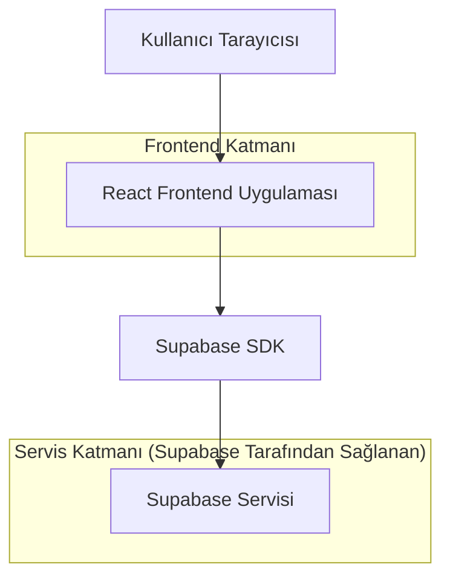
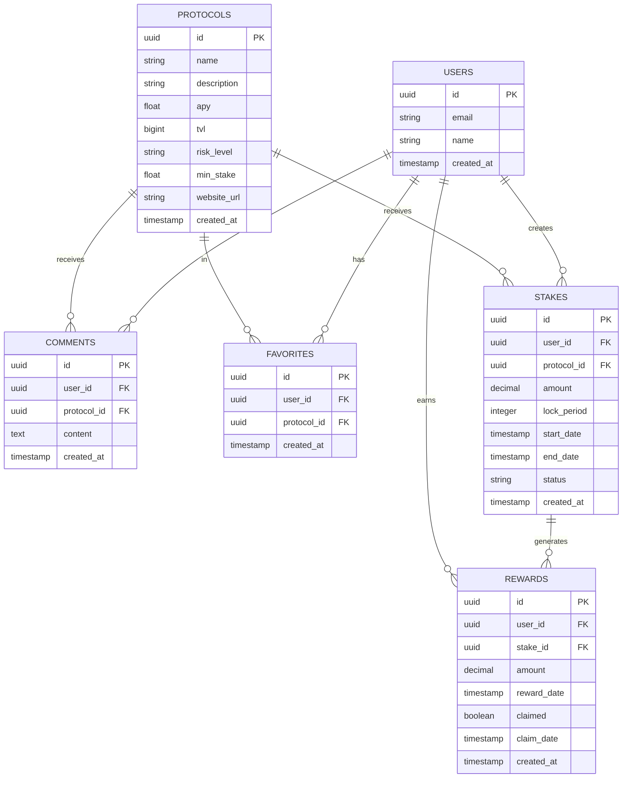

# StakeHub MVP - Teknik Mimari Dokümanı

## 1. Mimari Tasarım



## 2. Teknoloji Açıklaması

- **Frontend**: React@18 + TailwindCSS@3 + Vite
- **Backend**: Supabase (Authentication, Database, Storage)
- **Deployment**: Vercel (Frontend), Supabase Cloud (Backend)
- **Veri Kaynağı**: Supabase PostgreSQL veritabanı

## 3. Route Tanımları

| Route | Amaç |
|-------|------|
| / | Dashboard (Ana Sayfa), staking offerings, protokol listesi |
| /stake | Stake Management sayfası, token seçimi ve amount girişi |
| /rewards | Rewards Tracking sayfası, kullanıcı rewards'ları ve claim işlemleri |
| /protocol/:id | Protokol detay sayfası, APY grafikleri ve performans metrikleri |
| /auth | Kayıt/Giriş sayfası, email/şifre ile authentication |

## 4. Veri Modeli

### 4.1 Veri Modeli Tanımı



### 4.2 Veri Tanımlama Dili (DDL)

**Kullanıcılar Tablosu (users)**
```sql
-- Kullanıcılar tablosu oluştur
CREATE TABLE users (
    id UUID PRIMARY KEY DEFAULT gen_random_uuid(),
    email VARCHAR(255) UNIQUE NOT NULL,
    name VARCHAR(100) NOT NULL,
    created_at TIMESTAMP WITH TIME ZONE DEFAULT NOW()
);

-- İndeks oluştur
CREATE INDEX idx_users_email ON users(email);

-- Supabase yetkilendirme
GRANT SELECT ON users TO anon;
GRANT ALL PRIVILEGES ON users TO authenticated;
```

**Protokoller Tablosu (protocols)**
```sql
-- Protokoller tablosu oluştur
CREATE TABLE protocols (
    id UUID PRIMARY KEY DEFAULT gen_random_uuid(),
    name VARCHAR(100) NOT NULL,
    description TEXT,
    apy DECIMAL(5,2) NOT NULL,
    tvl BIGINT DEFAULT 0,
    risk_level VARCHAR(20) CHECK (risk_level IN ('low', 'medium', 'high')),
    min_stake DECIMAL(18,8) DEFAULT 0,
    website_url VARCHAR(255),
    created_at TIMESTAMP WITH TIME ZONE DEFAULT NOW()
);

-- İndeks oluştur
CREATE INDEX idx_protocols_apy ON protocols(apy DESC);
CREATE INDEX idx_protocols_risk ON protocols(risk_level);

-- Supabase yetkilendirme
GRANT SELECT ON protocols TO anon;
GRANT ALL PRIVILEGES ON protocols TO authenticated;

-- Başlangıç verileri (MVP için temel protokoller)
INSERT INTO protocols (name, description, apy, tvl, risk_level, min_stake, website_url) VALUES
('Cardano (ADA)', 'Cardano ağı delegasyon staking', 4.2, 12000000000, 'low', 10, 'https://cardano.org'),
('Ontology (ONT)', 'Ontology network staking', 5.8, 800000000, 'medium', 500, 'https://ont.io'),
('Solana (SOL)', 'Solana network validator staking', 6.5, 18000000000, 'medium', 1, 'https://solana.com'),
('Polkadot (DOT)', 'Polkadot nominator staking', 12.0, 8500000000, 'medium', 120, 'https://polkadot.network'),
('XRP Ledger', 'XRP Ledger validator staking', 3.8, 2200000000, 'low', 200, 'https://xrpl.org');
```

**Yorumlar Tablosu (comments)**
```sql
-- Yorumlar tablosu oluştur
CREATE TABLE comments (
    id UUID PRIMARY KEY DEFAULT gen_random_uuid(),
    user_id UUID REFERENCES users(id) ON DELETE CASCADE,
    protocol_id UUID REFERENCES protocols(id) ON DELETE CASCADE,
    content TEXT NOT NULL,
    created_at TIMESTAMP WITH TIME ZONE DEFAULT NOW()
);

-- İndeks oluştur
CREATE INDEX idx_comments_protocol_id ON comments(protocol_id);
CREATE INDEX idx_comments_created_at ON comments(created_at DESC);

-- Supabase yetkilendirme
GRANT SELECT ON comments TO anon;
GRANT ALL PRIVILEGES ON comments TO authenticated;
```

**Favoriler Tablosu (favorites)**
```sql
-- Favoriler tablosu oluştur
CREATE TABLE favorites (
    id UUID PRIMARY KEY DEFAULT gen_random_uuid(),
    user_id UUID REFERENCES users(id) ON DELETE CASCADE,
    protocol_id UUID REFERENCES protocols(id) ON DELETE CASCADE,
    created_at TIMESTAMP WITH TIME ZONE DEFAULT NOW(),
    UNIQUE(user_id, protocol_id)
);

-- İndeks oluştur
CREATE INDEX idx_favorites_user_id ON favorites(user_id);

-- Supabase yetkilendirme
GRANT SELECT ON favorites TO anon;
GRANT ALL PRIVILEGES ON favorites TO authenticated;
```

**Stakes Tablosu (stakes)**
```sql
-- Stakes tablosu oluştur
CREATE TABLE stakes (
    id UUID PRIMARY KEY DEFAULT gen_random_uuid(),
    user_id UUID REFERENCES users(id) ON DELETE CASCADE,
    protocol_id UUID REFERENCES protocols(id) ON DELETE CASCADE,
    amount DECIMAL(18,8) NOT NULL,
    lock_period INTEGER NOT NULL, -- gün cinsinden
    start_date TIMESTAMP WITH TIME ZONE DEFAULT NOW(),
    end_date TIMESTAMP WITH TIME ZONE NOT NULL,
    status VARCHAR(20) CHECK (status IN ('active', 'completed', 'cancelled')) DEFAULT 'active',
    created_at TIMESTAMP WITH TIME ZONE DEFAULT NOW()
);

-- İndeks oluştur
CREATE INDEX idx_stakes_user_id ON stakes(user_id);
CREATE INDEX idx_stakes_protocol_id ON stakes(protocol_id);
CREATE INDEX idx_stakes_status ON stakes(status);
CREATE INDEX idx_stakes_end_date ON stakes(end_date);

-- Supabase yetkilendirme
GRANT SELECT ON stakes TO anon;
GRANT ALL PRIVILEGES ON stakes TO authenticated;
```

**Rewards Tablosu (rewards)**
```sql
-- Rewards tablosu oluştur
CREATE TABLE rewards (
    id UUID PRIMARY KEY DEFAULT gen_random_uuid(),
    user_id UUID REFERENCES users(id) ON DELETE CASCADE,
    stake_id UUID REFERENCES stakes(id) ON DELETE CASCADE,
    amount DECIMAL(18,8) NOT NULL,
    reward_date TIMESTAMP WITH TIME ZONE DEFAULT NOW(),
    claimed BOOLEAN DEFAULT FALSE,
    claim_date TIMESTAMP WITH TIME ZONE,
    created_at TIMESTAMP WITH TIME ZONE DEFAULT NOW()
);

-- İndeks oluştur
CREATE INDEX idx_rewards_user_id ON rewards(user_id);
CREATE INDEX idx_rewards_stake_id ON rewards(stake_id);
CREATE INDEX idx_rewards_claimed ON rewards(claimed);
CREATE INDEX idx_rewards_reward_date ON rewards(reward_date DESC);

-- Supabase yetkilendirme
GRANT SELECT ON rewards TO anon;
GRANT ALL PRIVILEGES ON rewards TO authenticated;
```